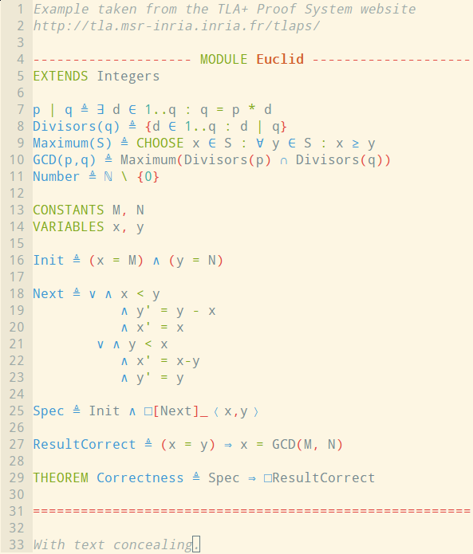
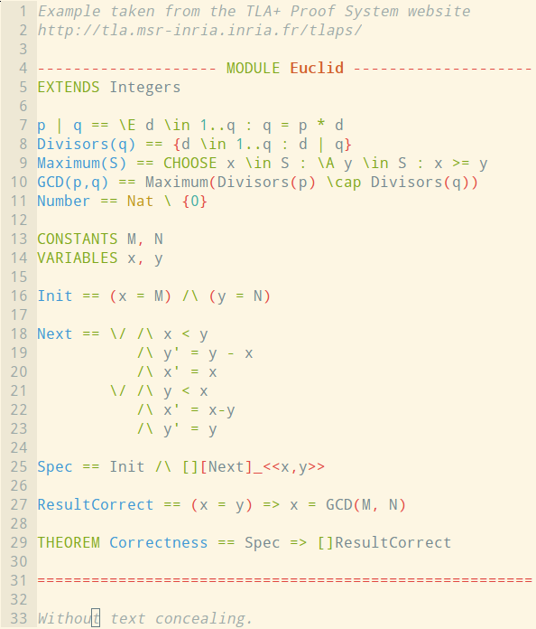

# vim-tla

vim-tla is a [Vim](http://www.vim.org) and [neovim](https://neovim.io/) filetype for the [TLA+](http://research.microsoft.com/en-us/um/people/lamport/tla/tla.html) specification language and the [TLA+ Proof System](http://tla.msr-inria.inria.fr/tlaps/content/Home.html).

 

## Features

* Filetype detection based on filename extension.
* Highlighting for all TLA+ keywords and operators.
* Highlighting of the TLA+ proof steps (TLA+ Proof System).
* Newly introduced identifiers are highlighted to help the definition of a local
  symbol:
    * Macros: `identifier == definition` and `LET identifier == definition IN
      body`;
    * Quantified variables: `\E identifier \in set: property` (also `\A`, `\AA`, `\E`,
      `\EE`) and `CHOOSE identifier \in set: property`.
* Highlighting for sets and operators from the standard modules.
* Extensive use of the Vim **conceal** feature: all operators can be depicted by the corresponding *unicode symbol*.
* Vim-friendly formatting of comments (automatic formatting and reformatting of multiline comments) and compatibility with [vim-commentary](https://github.com/tpope/vim-commentary).
* Text outside of a module is highlighted like comments.
    
## Installation

### Manual Installation

Copy the files in your Vim directory (usually `~/.vim`).

### Using vim-plug

With [vim-plug](https://github.com/junegunn/vim-plug), add a line corresponding to the `florentc/vim-tla` package in the appropriate section of your `.vimrc`. For instance:

    call plug#begin('~/.vim/plugged')
    " [...]
    Plug 'florentc/vim-tla'
    " [...]
    call plug#end()

Run `:PlugUpdate` to download or update vim-tla.

## Text concealing

When concealing is enabled, operators are displayed using the corresponding unicode character (for instance `∈` instead of `\in`). To enable text concealing:

    :set conceallevel=2

To disable text concealing:

    :set conceallevel=0

By default in normal mode and insert mode, concealing is disabled on the cursor line. See `:help concealcursor` to change these settings. When concealing is enabled, the `\*` marker of inline comments is hidden.

If the concealed characters are hardly visible, try different colorschemes or manually change the foreground and background colors for the `Conceal` highlight group. For example, the following commands will display concealed characters as black text on white background, adapt to your needs:

    :hi Conceal guifg=#000000
    :hi Conceal guibg=#ffffff

If you run Vim in a terminal emulator, you may enable true color support with `:set termguicolors`.
